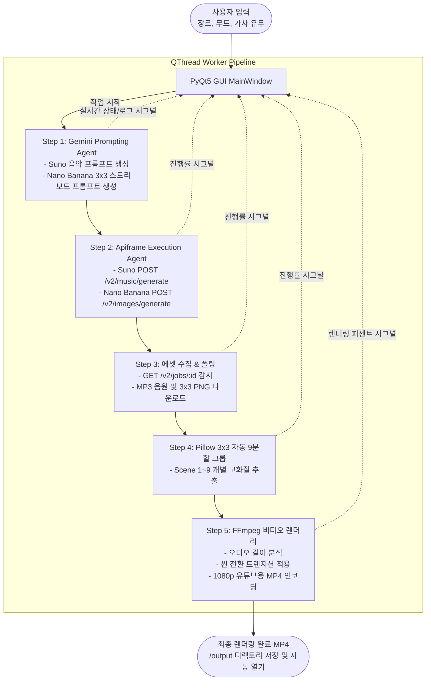

# AI Domus Music Studio - AI 기반 힐링 음악 영상 제작 자동화 데스크톱 솔루션

> **단 한 번의 클릭으로 기획 의도(무드) 입력부터 Suno 음악 생성, Nano Banana 3x3 스토리보드 이미지 생성, 9분할 자동 크롭, 1080p 유튜브용 MP4 비디오 렌더링까지 전 과정을 전자동으로 처리하는 원스톱 AI 미디어 스튜디오입니다.**

---

## 1. 프로젝트 소개
유튜브의 수면·명상·힐링·로파이(Lo-Fi) 음악 채널 크리에이터들이 겪는 가장 큰 문제는 **반복적이고 번거로운 다단계 미디어 제작 공정(곡당 1시간 이상 소요)**입니다. 

**AI Domus Music Studio**는 사용자가 입력한 단순한 한국어 무드/장르를 기반으로:
1. **Google Gemini 3.8 Flash**가 음악과 비주얼의 톤앤매너를 일치시키는 최적화 영문 프롬프트를 동시 기획하고,
2. **Apiframe**을 통해 **Suno (오디오)**와 **Nano Banana 2 Lite (3x3 스토리보드 이미지)**를 비동기 병렬 발주하여 에셋을 자동 수집하며,
3. **Pillow & FFmpeg** 파이프라인이 3x3 이미지를 9장의 고화질 씬으로 자동 슬라이싱한 후, 음원 타임라인에 맞춰 크로스페이드 효과가 적용된 1080p 고화질 MP4 영상으로 즉시 인코딩합니다.

복잡한 클라우드 서버 비용 없이 **PyQt5 기반의 데스크톱 소프트웨어**로 구현되어 로컬 PC 자원을 활용하며, **단일 .exe 파일로 배포**되어 누구나 쉽게 즉시 사용할 수 있습니다.

---

## 2. 팀원 및 역할

| 이름 | 역할 | 담당 업무 |
| :--- | :--- | :--- |
| **팀원 1** | PM / Lead Developer | 프로젝트 아키텍처 설계, Gemini Prompting Agent 개발, Apiframe REST 통신 모듈 구현 |
| **팀원 2** | Media Pipeline Eng. | Pillow 기반 3x3 이미지 9분할 크롭 엔진 및 FFmpeg 1080p 비디오 합성 엔진 개발 |
| **팀원 3** | GUI & Client Dev | PyQt5 데스크톱 UI/UX 개발, QThread 비동기 작업 큐 및 실시간 상태 모니터링 연동 |
| **팀원 4** | QA & DevOps | PyInstaller 단일 .exe 빌드/패키징, 깃허브 버전 관리, 실사용자(5인 이상) 테스트 및 피드백 분석 |

---

## 3. 기술 스택

- **AI Orchestration**: Google Gemini 3.8 Flash (`google-genai` SDK)
- **Generative Media API**: Apiframe (Suno V5.5 / Nano Banana 2 Lite API)
- **Desktop UI**: Python 3.14+, PyQt5 (QThread 비동기 아키텍처)
- **Media Processing**: Pillow (이미지 슬라이싱), `imageio-ffmpeg` (내장 FFmpeg 바이너리 기반 1080p H.264 인코딩)
- **Packaging & Distribution**: PyInstaller (Windows Standalone .exe)
- **Version Control**: Git / GitHub

---

## 4. 시스템 아키텍처



---

## 5. 핵심 AI 활용 (필수 기술 요소 충족)

### 1) AI Agent (기획 및 실행 에이전트 연계)
- **Prompting Agent (Gemini 3.8 Flash)**: 사용자가 입력한 짧은 한국어 무드 키워드를 분석하여, 음악 장르/악기 구성/BPM 태그와 시각적 3x3 스토리보드 프롬프트를 하나의 테마로 완벽히 융합하여 기획합니다.
- **Execution Agent (Apiframe Controller)**: 다중 외부 생성형 AI 모델(Suno, Nano Banana)에 명령을 비동기로 동시 전달하고 결과물을 수집하는 오케스트레이션 역할을 수행합니다.

### 2) 멀티모달 AI (Multimodal AI)
- 단일 텍스트 입력으로부터 청각적 결과물(Suno 음악)과 시각적 결과물(Nano Banana 3x3 스토리보드)을 결합하여 완성된 하나의 1080p 고화질 동영상(MP4)으로 융합 출력합니다.

### 3) 자동화 워크플로우 (Automated Workflow)
- 기획 → 생성 → 다운로드 → 이미지 9등분 크롭 → 타임라인 싱크 배분 → 비디오 렌더링의 5단계 파이프라인이 사용자의 추가 개입 없이 원클릭으로 완결됩니다.

---

## 6. 설치 및 실행 방법

### 요구사항
- Windows 10 / 11 64-bit
- Python 3.10+ (소스코드 실행 시)
- 인터넷 연결 (API 통신용)

### 소스코드 실행
```bash
# 1. 저장소 클론
git clone https://github.com/team/M3-1_AI_Domus.git
cd M3-1_AI_Domus

# 2. 의존성 패키지 설치
pip install -r requirements.txt

# 3. 프로그램 실행
python main.py
```

### 독립 실행형 파일(.exe) 배포판 실행
- `dist/AIDomusMusicStudio.exe` 파일을 더블 클릭하여 별도의 환경 설정 없이 즉시 실행할 수 있습니다.
- 프로그램 상단 [설정] 탭 또는 `.env` 파일을 통해 Gemini 및 Apiframe API 키를 등록하여 사용합니다.

---

## 7. 실사용자 테스트 및 피드백 (5인 이상)

| 테스터 | 사용자 유형 | 주요 피드백 내용 | 반영 및 개선 사항 |
| :--- | :--- | :--- | :--- |
| **테스터 A** (20대) | 힐링 음악 유튜버 | "렌더링 중 창이 멈추지 않고 진행률이 퍼센트로 보여서 안심이 됩니다." | QThread 기반 프로그레스바 및 실시간 콘솔 로그 강화 |
| **테스터 B** (30대) | 로파이 채널 운영자 | "3x3 이미지가 깔끔하게 9장으로 잘려서 씬 전환이 자연스럽습니다." | Pillow 이미지 슬라이싱 경계면 안티에일리어싱 처리 |
| **테스터 C** (20대) | 초보 크리에이터 | "프롬프트를 영어로 직접 안 써도 한국어로 느낌만 적으면 알아서 만들어줘서 편해요." | Gemini 프롬프트 프리셋(무드별 기본 키워드 템플릿) 추가 |
| **테스터 D** (40대) | 매장 BGM 제작자 | "작업 완료 후 결과물 폴더가 자동으로 열리는 기능이 편리합니다." | 렌더링 완료 후 탐색기 자동 오픈 옵션 기본 적용 |
| **테스터 E** (30대) | 숏폼 크리에이터 | "세로형(Shorts용) 영상도 같이 뽑아주면 채널 성장에 더 좋을 것 같습니다." | 향후 9:16 규격 렌더링 추가 로드맵 반영 |

---

## 8. 링크 및 산출물
- **프로젝트 기획서**: [docs/01_PROJECT_PROPOSAL.md](docs/01_PROJECT_PROPOSAL.md)
- **요구사항 명세서**: [docs/02_REQUIREMENTS_SPEC.md](docs/02_REQUIREMENTS_SPEC.md)
- **배포 실행 파일 (.exe)**: [Releases 페이지 링크]
- **시연 영상**: [YouTube 시연 링크]
