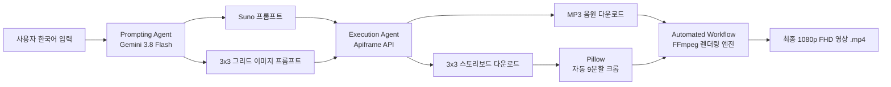

# [프로젝트 기획서] AI 기반 힐링 음악 영상 제작 자동화 시스템 (AI Domus Music Studio)

---

## 1. 프로젝트 개요

| 항목 | 내용 |
| :--- | :--- |
| **프로젝트명** | AI 기반 음악 및 영상 제작 자동화 데스크톱 솔루션 (AI Domus Music Studio) |
| **개발 기간** | 2026.10 ~ (팀 프로젝트 진행 기간) |
| **주요 기술** | Gemini 3.8 Flash, Apiframe (Suno & Nano Banana 2 Lite), PyQt5, FFmpeg, Pillow |
| **배포 형태** | Windows Standalone Executable (.exe) |

---

## 2. 기획 의도 및 문제 정의 (Problem Definition)

### 2.1 기존 미디어 제작 방식의 한계와 병목
유튜브의 수면·명상·힐링·로파이(Lo-Fi) 음악 채널(예: '천사와 춤을', 'Gentle Mind' 등)은 특성상 **일관된 무드의 고품질 음악과 비주얼을 주 3~5회 이상 대량 생산**해야 채널 알고리즘 성장과 구독자 유지가 가능합니다.
그러나 현재 크리에이터들이 겪고 있는 제작 파이프라인은 심각한 다단계 수작업 병목을 안고 있습니다:

1. **프롬프트 작성 병목**:
   - Suno(음악)와 AI 이미지 생성기(Midjourney, Google Flow, Nano Banana 등)의 프롬프트 문법과 파라미터가 상이하여, 매번 개별 플랫폼에 맞춰 영문 프롬프트를 따로 작성하고 톤앤매너를 일치시키는 데 많은 시간 소모.
2. **수작업 다운로드 및 에셋 관리 병목**:
   - 각 웹 플랫폼에 접속하여 오디오(mp3)와 이미지(3x3 그리드 등)를 개별 다운로드하고 로컬에 정리하는 번거로움.
3. **이미지 분할 및 비디오 편집 병목**:
   - 3x3 스토리보드 이미지를 포토샵이나 온라인 툴로 일일이 9장으로 크롭한 뒤, 캡컷(CapCut)·프리미어 등의 영상 편집기에 올려 음원 길이(3~4분)에 맞춰 타임라인을 나누고 전환 효과를 넣는 편집 작업에 곡당 1시간 이상의 단순 노동 소요.
4. **시스템 리소스 및 비용 부담**:
   - 고사양 편집 소프트웨어의 구독료와 클라우드 영상 렌더링 서버의 호스팅 비용 발생.

### 2.2 해결 방안
- **원클릭 자동화 솔루션**: 한국어 키워드/무드 입력 한 번으로 **프롬프트 기획 → 음악 & 이미지 생성 → 에셋 다운로드 → 3x3 이미지 자동 9분할 → 음원 싱크 맞춤 및 1080p 영상 렌더링**까지 전 과정을 단일 데스크톱 프로그램 내에서 백그라운드로 처리합니다.
- **로컬 자원 활용**: 클라우드 서버 비용 없이 사용자의 로컬 PC 자원(FFmpeg)을 활용하여 영상을 렌더링하므로 서버 유지비가 전혀 들지 않으며 안정적입니다.

---

## 3. 타겟 사용자 (Target Audience)

1. **1인 미디어 크리에이터 & 부업 유튜버**:
   - 수면 유도 음악, 명상 BGM, 로파이(Lo-Fi), 카페 뉴에이지 등 음악 기반 채널을 운영하며 매일/매주 대량의 영상을 업로드해야 하는 크리에이터.
2. **비전문가 사용자**:
   - 전문적인 영상 편집 도구(프리미어, 캡컷)의 타임라인 기능이나 영어 프롬프트 엔지니어링 지식이 없지만, 고화질/고음질 멀티모달 콘텐츠를 원클릭으로 제작하고자 하는 사용자.
3. **콘텐츠 에이전시 및 브랜드 마케터**:
   - 매장용 BGM, 브랜드 무드 비디오를 빠르고 일관되게 대량 생성해야 하는 실무자.

---

## 4. AI 활용 방식 및 기술적 접근 방식 (필수 기술 요소 충족)

본 프로젝트는 미션 매뉴얼의 필수 기술 요소 3가지를 완벽히 결합하여 설계되었습니다:

### 4.1 AI Agent (기획 및 실행 에이전트 연계)
- **Prompting Agent (Google Gemini 3.8 Flash)**:
  - 사용자가 입력한 단순 한국어 무드/장르(예: "비 오는 날 카페에서 듣는 차분한 로파이 피아노곡")를 분석.
  - 일관된 스토리와 정서를 유지하도록 **Suno 최적화 음악 프롬프트/태그**와 **Nano Banana 2 Lite 최적화 3x3 스토리보드 이미지 프롬프트**를 동시 기획·생성.
- **Execution Agent (Apiframe Controller)**:
  - Apiframe REST API를 통해 Suno 음악 생성 작업과 Nano Banana 2 Lite 이미지 생성 작업을 동시 비동기 발주.
  - 주기적 폴링(Polling)을 통해 진행 상황을 추적하고, 완료 시 에셋 URL로부터 로컬 캐시로 자동 수집.

### 4.2 멀티모달 AI (Multimodal AI)
- 단일 기획 의도로부터 **청각적 에셋(Suno 생성 오디오)**과 **시각적 에셋(Nano Banana 2 Lite 3x3 스토리보드 이미지)**을 상호 연계하여 동시 생성.
- 오디오의 길이와 BPM 분위기에 맞춰 분할된 시각 프레임의 타임라인을 매핑하여 하나의 완성도 높은 1080p 멀티모달 비디오 콘텐츠로 융합.

### 4.3 자동화 워크플로우 (Automated Workflow)
- **Zero-Touch 파이프라인**:
  - `[생성 시작]` 클릭 한 번으로 모든 백엔드 프로세스가 순차적으로 연쇄 실행.
  - API 발주 → 다운로드 → Pillow 3x3 9분할 크롭(1:1 해상도 슬라이싱) → 오디오 재생시간 분석 → 씬별 타임라인 분배 및 크로스페이드 트랜지션 → 1080p 60/30fps MP4 렌더링까지 전 과정 자동화.

---

## 5. 추진 일정 및 WBS (Work Breakdown Structure)

| 단계 | 기간 | 주요 업무 내용 | 산출물 |
| :--- | :--- | :--- | :--- |
| **1단계: 기획 및 설계** | 1~2일차 | 문제 정의, 기술 검증(API 핑 테스트), 요구사항 명세서 및 아키텍처 수립 | 기획서, 요구사항 명세서 |
| **2단계: AI 에이전트 구현** | 3~4일차 | Gemini 프롬프트 오케스트레이션, Apiframe Suno/Nano 비동기 연동 | `gemini_agent.py`, `apiframe_agent.py` |
| **3단계: 미디어 파이프라인** | 5~6일차 | 3x3 이미지 자동 9분할 크롭, FFmpeg 영상 인코딩 엔진 연동 | `image_processor.py`, `video_renderer.py` |
| **4단계: GUI 및 통합** | 7~8일차 | PyQt5 사용자 인터페이스 구현, QThread 비동기 작업 및 진행률 연동 | `app_window.py`, `main.py` |
| **5단계: 빌드 및 배포** | 9일차 | PyInstaller .exe 단일 패키징, 깃허브 릴리즈 및 배포 링크 생성 | Standalone .exe, README.md |
| **6단계: 실사용자 테스트** | 10~11일차 | 5명 이상의 크리에이터 테스터 대상 실사용 피드백 수집 및 기능 개선 | 테스트 결과 보고서, 최종 개선본 |

---

## 6. 기대효과 및 향후 확장 방안

1. **공수 90% 이상 절감**: 곡당 1시간 이상 소요되던 작업(프롬프트 작성, 다운로드, 분할, 영상 싱크)을 **키워드 입력 후 1클릭**으로 단축.
2. **제로 서버 비용**: 로컬 PC 인코딩 기반 데스크톱 소프트웨어로 클라우드 인프라 유지비 제로화.
3. **톤앤매너 일치로 채널 브랜딩 강화**: 음악과 9개 씬의 비주얼이 Gemini 에이전트에 의해 단일 테마로 일관되게 생성.
4. **확장성**: 추후 유튜브 숏폼(9:16) 자동 리사이징 및 예약/대량 배치 생성 기능 지원 가능.
