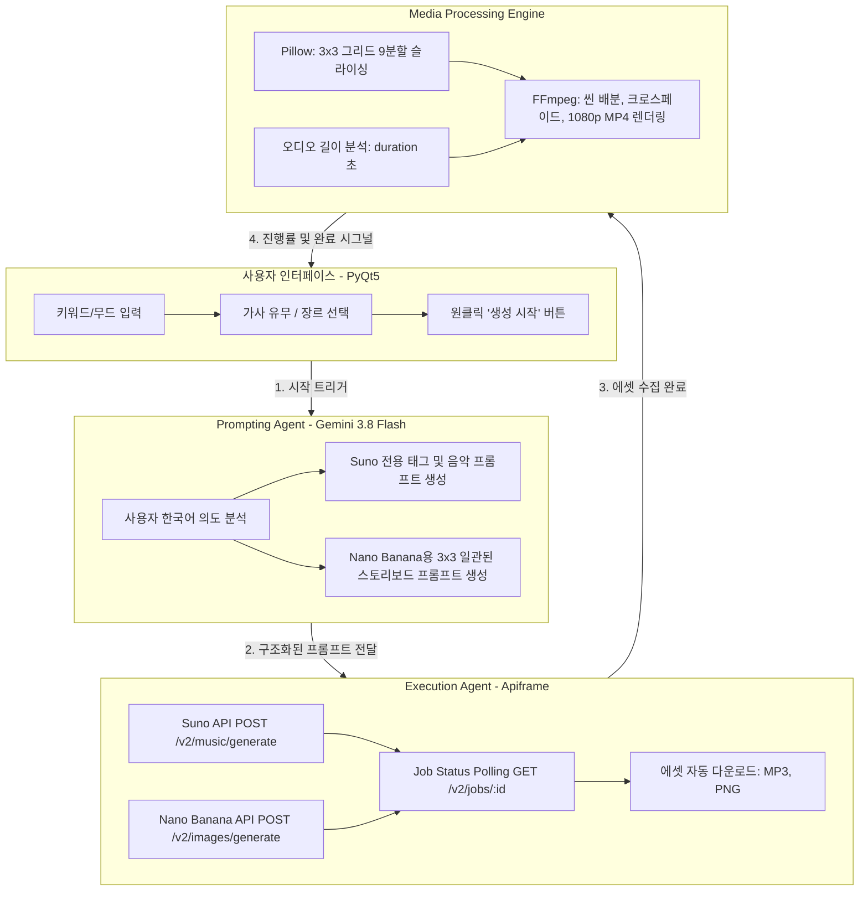

# [요구사항 정의서 및 아키텍처 설계서] AI Domus Music Studio

---

## 1. 개요
- **시스템명**: AI Domus Music Studio (AI 기반 음악 및 영상 제작 자동화 데스크톱 프로그램)
- **개발 목적**: 유튜브 힐링/BGM 크리에이터를 위해 프롬프트 기획, 오디오/이미지 AI 생성, 3x3 이미지 자동 분할, 음원 싱크 영상 렌더링까지 전 과정을 원스톱으로 처리하는 데스크톱 프로그램 구축
- **운영 환경**: Windows 10/11 (Standalone Executable)

---

## 2. 기능 요구사항 (Functional Requirements)

| ID | 구분 | 기능명 | 설명 | 우선순위 |
| :--- | :--- | :--- | :--- | :--- |
| **FR-01** | 입력 UI | 사용자 의도 입력 | 분위기/무드 텍스트, 장르 선택(뉴에이지, 로파이, 시네마틱, 재즈 등), 가사 유무(Instrumental 여부)를 입력받음 | Must |
| **FR-02** | 환경 설정 | API 키 관리 | Gemini API 키, Apiframe Suno 키, Apiframe Nano Banana 키를 UI에서 설정하고 로컬 암호화/저장(.env) | Must |
| **FR-03** | AI 기획 | Gemini Prompting Agent | 사용자 한국어 입력을 분석하여 Suno용 음악 프롬프트/태그 및 Nano Banana 2 Lite용 3x3 스토리보드 프롬프트를 동시 생성 | Must |
| **FR-04** | AI 생성 | Apiframe 멀티모달 생성 | Suno 및 Nano Banana 2 Lite 생성 API를 비동기 호출하고 작업 완료까지 폴링 모니터링 | Must |
| **FR-05** | 에셋 수집 | 에셋 자동 다운로드 | 완료된 MP3 음원과 고해상도 3x3 스토리보드 이미지(PNG/JPEG)를 프로젝트 작업 폴더로 자동 다운로드 | Must |
| **FR-06** | 이미지 처리 | 3x3 그리드 자동 9분할 | 다운로드된 3x3 스토리보드 이미지를 9개의 균등한 고화질 씬(Scene 1~9) 이미지로 자동 분할 및 저장 | Must |
| **FR-07** | 영상 렌더링 | 타임라인 싱크 & 1080p MP4 합성 | FFmpeg를 활용하여 음원의 총 재생시간을 9분할 씬에 균등 분배하고, 부드러운 전환 효과(Fade/Crossfade)를 주어 1080p 고화질 MP4 영상 렌더링 | Must |
| **FR-08** | 비동기 UI | 실시간 진행률 및 로그 | 장시간 작업(생성 및 인코딩) 중 UI 멈춤 현상(Freezing) 방지를 위한 QThread 멀티스레딩, 단계별 프로그레스바 및 실시간 콘솔 로그 제공 | Must |
| **FR-09** | 결과 확인 | 결과물 미리보기 및 폴더 열기 | 작업 완료 후 생성된 MP4 비디오, MP3 오디오, 9장의 이미지가 저장된 폴더를 탐색기로 즉시 열 수 있는 편의 기능 제공 | Should |
| **FR-10** | 숏폼 확장 | 세로형(9:16) 영상 렌더링 옵션 | 유튜브 쇼츠/틱톡 업로드를 위한 9:16 규격 영상 자동 변환 옵션 | Could |

---

## 3. 비기능 요구사항 (Non-Functional Requirements)

| ID | 항목 | 요구사항 | 검증 방식 |
| :--- | :--- | :--- | :--- |
| **NFR-01** | 응답성 및 안정성 | 영상 인코딩 및 장시간 API 대기 중에도 UI 창이 '응답 없음' 상태가 되지 않아야 함 | PyQt5 `QThread` 워커 스레드와 `pyqtSignal`을 통해 백그라운드 분리 |
| **NFR-02** | 설치 및 휴대성 | Python이나 외부 코덱의 사전 설치 없이 일반 사용자가 .exe 더블클릭만으로 즉시 구동 가능해야 함 | PyInstaller 패키징 및 내장 `imageio-ffmpeg` 바이너리 포함 |
| **NFR-03** | 출력 화질/음질 | 유튜브 권장 규격 충족: 1080p FHD (1920x1080, 30fps 이상), H.264 인코딩, AAC 192kbps 스테레오 음질 | FFmpeg 인코딩 파라미터 표준화 (`-c:v libx264 -pix_fmt yuv420p -c:a aac -b:a 192k`) |
| **NFR-04** | 예외 처리 | API 호출 실패, 네트워크 단절, 키 오류 발생 시 프로그램이 강제 종료되지 않고 사용자에게 명확한 에러 메시지 팝업 | Try-Except 및 로깅 인터셉터 구현 |
| **NFR-05** | 개인정보 및 키 보안 | API 키는 소스코드 하드코딩이 아닌 `.env` 및 로컬 설정 파일에 암호화/분리 저장되어 GitHub에 유출되지 않음 | `.gitignore` 적용 및 UI 기반 동적 키 주입 |

---

## 4. AI 활용 상세 명세



---

## 5. 시스템 아키텍처 및 모듈 구조

```
M3-1_AI Domus/
├── docs/                             # 공식 프로젝트 기획 및 요구사항 명세 문서
│   ├── 01_PROJECT_PROPOSAL.md
│   └── 02_REQUIREMENTS_SPEC.md
├── src/
│   ├── config.py                     # API 키, 경로, 설정값 관리
│   ├── agents/
│   │   ├── gemini_agent.py           # Gemini 3.8 Flash 프롬프트 오케스트레이터
│   │   └── apiframe_agent.py         # Apiframe Suno / Nano Banana REST 클라이언트
│   ├── media/
│   │   ├── image_processor.py        # 3x3 그리드 이미지 9분할 크롭 모듈
│   │   └── video_renderer.py         # imageio-ffmpeg 기반 MP4 고화질 렌더링 엔진
│   └── gui/
│       ├── app_window.py             # PyQt5 메인 윈도우 UI 및 이벤트 처리
│       └── worker.py                 # QThread 비동기 실행 파이프라인
├── output/                           # 생성된 MP3, 씬 이미지, 최종 MP4 저장 디렉토리
├── main.py                           # 실행 진입점
├── build_exe.py                      # PyInstaller 원클릭 배포 빌드 스크립트
├── requirements.txt                  # 종속 패키지 목록
└── README.md                         # 팀 프로젝트 최종 보고서 겸 저장소 메인 설명서
```
